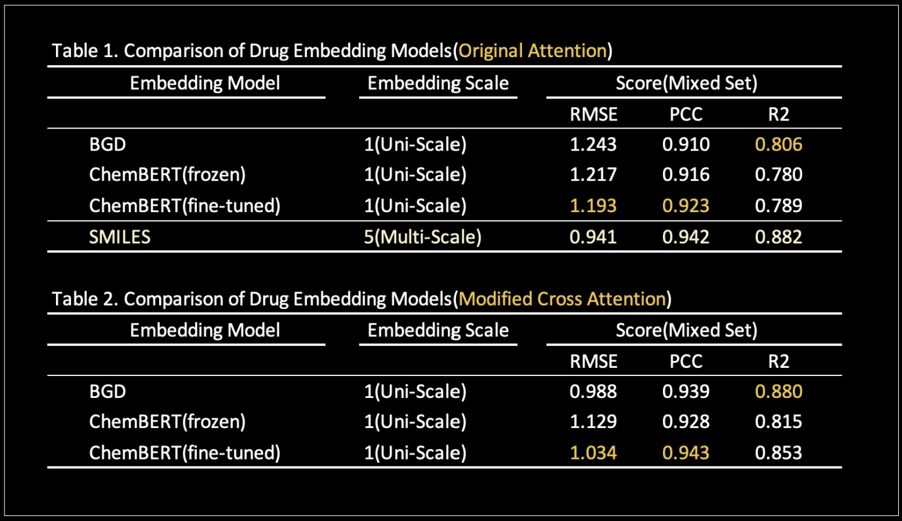

## 💊 MultiOmics based Drug Sensitivity Estimation - 6th Yaicon
### 🏆 2025 Spring 6th YAICON SECOND PRIZE

## Task Explanation

  
  

# Repositories 👀

#### Main
- ChemBERT based Drug embedding
  > implemented by [Yoonjin Cho](https://github.com/darejinn)
- Graph-Transformer based embedding
  > implemented by [GyungDeok Bae](https://github.com/bgduck33)
- Original Attention, Modified Cross attention
  > implemented by [GyungDeok Bae](https://github.com/bgduck33), [Yoonjin Cho](https://github.com/darejinn)

#### DGL-Life-sci
- DGL-Life-Sci based Drug embedding

  > implemented by [Junseo Ha](https://github.com/Carolyn-Ha) 

## Evaluation
SMILES = PASO

## Reference
### [PASO: Drug Response Prediction Model](https://github.com/queryang/PASO)

## Members
### [Yoonjin Cho](https://github.com/darejinn) (Team Lead)
Project proposal & overall leading, multi-omics & ChemBERT-based modeling, server management, model experiments, and result visualizations

### [GyungDeok Bae](https://github.com/bgduck33) (Presenter)
Model development lead, PASO proposal, GNN-based embedding design, server troubleshooting, attention mechanism development, model experiments

### [Junseo Ha](https://github.com/Carolyn-Ha) 
Graph-based drug representation (DGLlife GIN, AttFP, MPNN), PASO architecture analysis, model experiments

### [Yoonju Cho](https://github.com/whdsbwn)
Attention mechanism enhancement, PASO baseline model experiments, model experiments

### [Daeseong Kim](https://github.com/lemonardo1)
Initial ideation, dataset/server (AWS) support, in vitro validation
