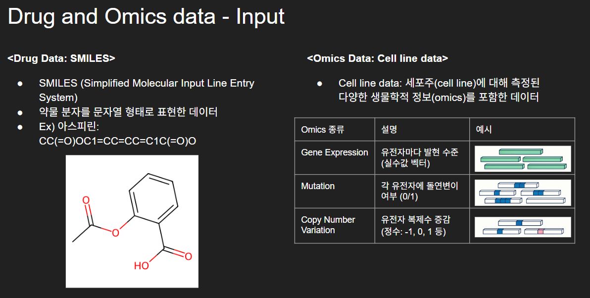
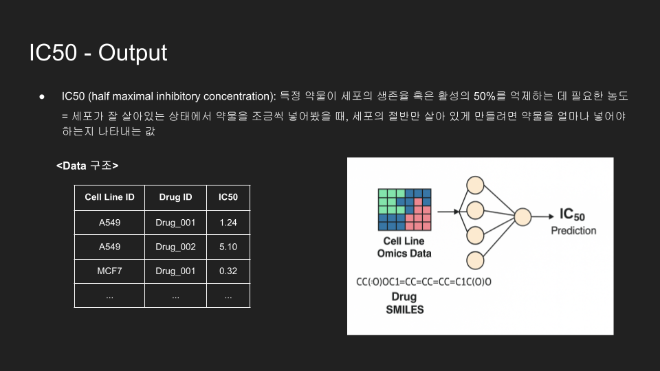

# 💊 Multi-Omics-Based Drug Sensitivity Estimation  
*6th YAICON — Spring 2025 · **Second Prize***

---

## 📌 Overview
Accurately predicting how a cancer cell line responds to a drug (IC-50) remains an open challenge: the outcome depends not only on the drug’s chemistry but also on the cell’s intricate molecular profile.  
We present an end-to-end deep-learning pipeline that **fuses three omics layers (GEP, MUT, CNV)** with advanced **drug-embedding models (ChemBERTa & graph-based GNN)** and a **bi-directional cross-attention mechanism**. Our approach improves upon the 2025 benchmark paper  
[*“Anticancer drug response prediction integrating multi-omics pathway-based difference features and multiple deep-learning techniques.”*](https://journals.plos.org/ploscompbiol/article?id=10.1371/journal.pcbi.1012905)

  
  

---

## 🌱 Why we built this
| Baseline limitation | Our upgrade |
| ------------------- | ----------- |
| **Drug representation lacks structural cues** (only SMILES RNN) | **Two interchangeable drug encoders** • *ChemBERTa* — language-style SMILES embedding • *BGD* — graph transformer on molecular graphs |
| **Shallow “context attention”** can’t model complex drug-omics interplay | **Deep, bi-directional cross-attention** (drug ↔ each omics) giving **6 interaction maps** |

---

## 🔬 Data
| Source | Entities | Notes |
| ------ | -------- | ----- |
| **CCLE** | 688 cell lines | GEP (log₂ TPM + 1), MUT (0/1/2), CNV (log₂ discrete) |
| **GDSC2** | 233 drugs | Matched IC-50 ground-truth |
| **MSigDB – 619 KEGG pathways** | – | Used to derive pathway-difference statistics (Mann-Whitney U / χ²-G) |

---

## 🛠 Methodology
1. **Omics pathway features**  
   For every cell line × pathway, compute statistical separation between “in-pathway” and “out-pathway” genes → 3 feature matrices of size 1 × 619 (GEP, MUT, CNV).

2. **Drug embeddings**  
   *Choose one encoder at training time*  
   | Encoder | Key idea | Output shape |
   | ------- | -------- | ------------ |
   | **ChemBERTa** | Tokenise SMILES, pad to 256, take final hidden CLS | 1 × 384 |
   | **BGD** | Graph transformer over atoms/bonds + DeepChem node feats | 1 × 256 |

3. **Cross-attention block**  
   • Drug (Q) ↔ Omics (K,V) for each omics type, **two directions** (drug→omics, omics→drug) → 6 attention layers in total.  
   • Concatenate pooled outputs → stacked MLP → IC-50 regression.

  

*Implementation diagram above: original (top) vs. modified cross-attention (bottom).*

---

## 📂 Code & Repos

| Repository | Description |
| ---------- | ----------- |
| **[Drug-Sensitivity-Prediction-Pipeline](https://github.com/Omics-based-Drug-sensitivity-Estimation/Drug-Sensitivity-Prediction-Pipeline)** | Main training pipeline, model zoo, experiment scripts |
| **[DGL-Life-sci](https://github.com/Omics-based-Drug-sensitivity-Estimation/DGL-Life-sci)** | Custom extensions for graph-based drug encoders |

Model zoo snapshots

#### ChemBERTa Drug Embedding

  

#### Graph-Transformer Drug Embedding

  

---

## 📊 Results

  
   <em>Figure 1. Drug embedding comparison (Original vs. Modified attention)</em>

  
   <em>Figure 2. Cross-attention variant performance</em>

  
   <em>Figure 3. Pearson r on cell-blinded split (scatter)</em>

Key takeaway : **+Improvement over the baseline when switching to ChemBERTa/BGD-Model + cross-attention. Full metrics in `/results/`.

---

## 🔗 Reference
* **PASO** – <https://github.com/queryang/PASO>

---

## 👥 Team

| Name | Role | GitHub |
| ---- | ---- | ------ |
| **Yoonjin Cho** | Team lead · Proposal · Multi-omics & ChemBERT modeling · Server ops · Experiments · Visualisation | [@darejinn](https://github.com/darejinn) |
| **Gyungdeok Bae** | Presenter · Model dev lead · PASO & GNN design · Troubleshooting · Attention modules | [@bgduck33](https://github.com/bgduck33) |
| **Junseo Ha** | Graph-based drug rep (GIN, AttFP, MPNN) · PASO analysis · Experiments | [@Carolyn-Ha](https://github.com/Carolyn-Ha) |
| **Yoonju Cho** | Attention improvement · Baseline experiments | [@whdsbwn](https://github.com/whdsbwn) |
| **Daeseong Kim** | Initial idea · Dataset/AWS support · *in vitro* validation | [@lemonardo1](https://github.com/lemonardo1) |

---

